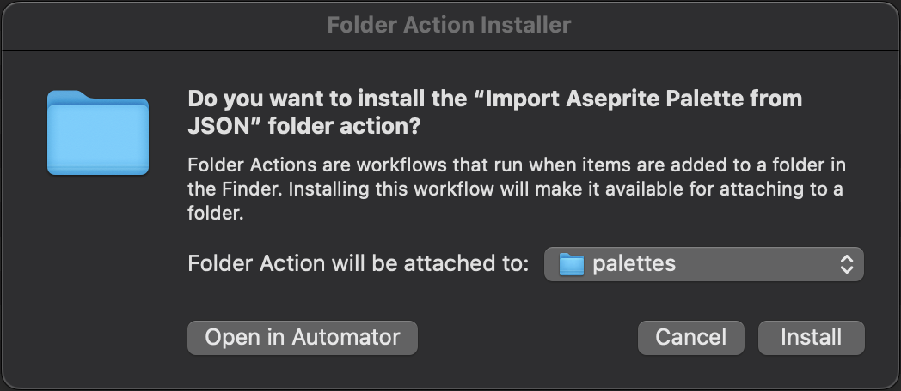
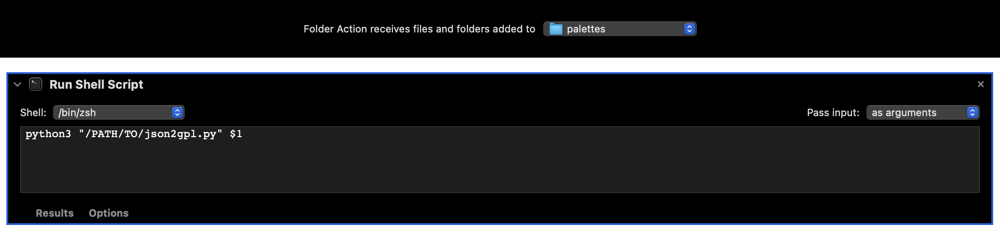

# JSON2GPL

**JSON2GPL** is a Python script that converts JSON color palette files into GPL (GIMP Palette) format.

This script was made to work with JSON files exported by the [Sip](https://sipapp.io) color picker app for Mac OS, but any JSON file describing a color palette can be used as long as it's formatted properly.

I use it in conjunction with a Mac OS Automator folder action to automatically convert JSON color palettes to GPL when they're added to my Aseprite palettes folder, but you can use it however you want.

The JSON file is expected to contain a `"name"` key which defines the name of the color palette, and a `"colors"` key which contains a array of color objects with `"name"` and "`hex`" keys, and

### Example JSON

```json
{
   "name": "My Palette",
   "colors": [
      {"name": "NormalRed", "hex": "#ff7f7f"},
      {"name": "NormalGreen", "hex": "#7fff7f"},
      {"name": "NormalBlue", "hex": "#7f7fff"}
   ]
}
```

### JSON Schema

```json
{
   "$schema": "http://json-schema.org/draft-07/schema#",
   "title": "Color Palette Schema",
   "type": "object",
   "properties": {
      "name": {
         "type": "string"
      },
      "colors": {
         "type": "array",
         "items": {
            "type": "object",
            "properties": {
               "name": {
                  "type": "string"
               },
               "hex": {
                  "type": "string",
                  "pattern": "^#[0-9A-Fa-f]{6}$"
               }
            },
            "required": ["name", "hex"],
            "additionalProperties": false
         }
      }
   },
   "required": ["colors", "name"],
   "additionalProperties": false
}
```

## Installation

1. Install Python 3 if not already installed.
2. Clone or download the repository:
   ```bash
   git clone https://github.com/jriggles/JSON2GPL.git
   ```

## Python Dependencies
None!

## Mac OS Automator Setup *(optional)*

### Folder Action Workflow

Navigate to wherever you cloned the repo and then double-click on "Import Aseprite Palette from JSON.workflow" file. You'll see the following dialog:



>[!IMPORTANT]
>Don't click **Install** just yet! Keep reading below

Click on **Open in Automator** to finish configuring the Folder Action. You'll see this in Automator:



From here, you'll need to...:

1. Make sure to set the "Folder Action receives files and folders added to ..." option to your Aseprite palettes directory (or wherever you want to bind the Folder Action)

2. Update the quoted path in the line `python3 "/PATH/TO/json2gpl.py" $1` so it points to the `json2gpl.py` file on your machine

3. Save the changes you made and exit Automator

4. Double-click on "Import Aseprite Palette from JSON.workflow" file again, and this time click "Install"

Once installed, the folder action will automatically convert any new JSON color palette files to GPL format when added to the target folder.

## Using the Script Directly

To run the conversion manually:

```bash
python3 json2gpl.py /path/to/your/palette.json
```

The converted GPL file will be saved in the same directory as the original JSON file.

## License

This project is licensed under the MIT License.
